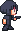

# 🎮 Trauma — C/C++ Platformer Demo (SDL3 + CMake)

**Trauma** is a lightweight platformer game demo built from scratch using **C/C++**, **SDL3**, and **CMake**.  
This project is a clean foundation for 2D game engines, input handling, entity systems, and rendering pipelines.

---

## ✨ Features

- 🏃 **2D platformer movement** (run, jump, gravity, collision)
- 🎨 **Tile-based world**
- 🎯 **Basic entity system**
- ⌨️ **Smooth input handling**
- 🎵 (Optional) Audio placeholder support
- ⚙️ **Cross-platform build** via CMake
- 🧱 Minimal, readable code structure — perfect for extending into a full game

---

## 📁 Project Structure

```
Trauma/
├── assets/ # sprites, tilesets, audio
├── src/
│    ├── main.cpp
│    ├── game.cpp
│    ├── renderer.cpp
│    ├── input.cpp
│    ├── physics.cpp
│    └── ...
├── include/ # header files
├── CMakeLists.txt
└── README.md
```

---

## 🛠️ Requirements

Ensure the following dependencies are installed:

- **CMake 3.25+**
- **C++20 compatible compiler (GCC/Clang/MSVC)**
- **SDL3 development libraries**
- **Git** (optional)

---

## 🔧 Build & Run

Clone the repository:

```bash
git clone https://github.com/your-username/trauma.git
cd trauma
```

Create a build folder:
```bash
mkdir build && cd build
```

Generate build files:
```bash
cmake ..
```

Compile:
```bash
cmake --build .
```

Run the game:
```bash
./trauma
```

---

## 🎮 Controls

| Key                 | Action     |
| ------------------- | ---------- |
| **A / Left Arrow**  | Move Left  |
| **D / Right Arrow** | Move Right |
| **W / UP Arrow**    | Jump       |
| **S / Down Arrow**  | slide      |
| **Space**           | Jump       |
| **Esc**             | Quit       |

---

## 🖼️ Preview

Add your screenshots or GIFs here.




---

## 🚀 Roadmap

- [ ] Add enemies (basic AI)
- [ ] Player animation system
- [ ] Parallax background
- [ ] Improve physics
- [ ] Add sound effects & music
- [ ] Level editor (Aseprite)
- [ ] Expand world/levels

---

## 🤝 Contributing

Contributions are welcome!  
Open an issue or submit a pull request to improve the project.

---

## 📜 License

This project is licensed under the **MIT License**.

---

## 🙏 Credits

Built with ❤️ using **C/C++**, **SDL3**, and **CMake**.


